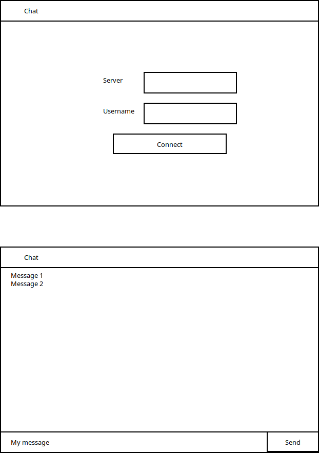

# Chat - java-koolitus-2018-03

## [Slides](https://docs.google.com/presentation/d/1wjm11HDtJEvrstCHfpo1LaSiUrvTOPVugp7PiQtmrzQ)

# Functional requirements
* Connect to a WebSocket server
* Set Username
* Show received messages
* Send messages

# Design mockup

